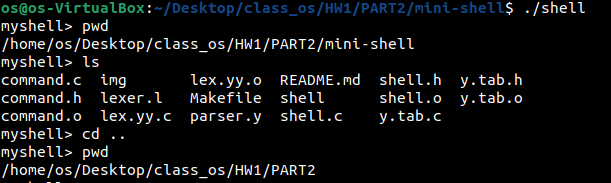
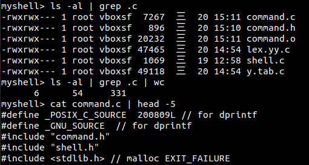
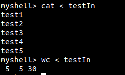
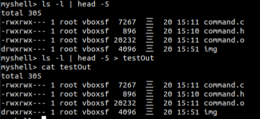
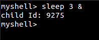

# 精簡版Shell

### OS Version 
```
Linux os-VirtualBox 5.19.11-M113040047 #1 SMP PREEMPT_DYNAMIC Sun Mar 19 03:01:11 CST 2023 x86_64 x86_64 x86_64 GNU/Linux
```

### How to install
1. `sudo apt install flex bison libreadline-dev libreadline8 -y`
2. go to mini-shell folder : `cd mini-shell`
3. `make`
4. run shell : `./shell`

### Program
1. readline library has tab-complete function.We also can use up-and-down key to navigate the history input
2. In this mini shell, I use flex and yacc to parse the input.
3. Features
	* I/O Redirection
	* Pipe
	* Background processing
	* `exit` : exit the shell
	* `cd` : build-in function, running in the main process

### Demonstration
1. executing single-process command<br>

2. two-processes pipeline<br>

3. input, output redirection<br>

e
4. background<br>



